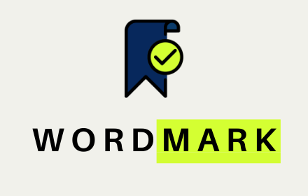

  

  <h3 align="center">WordMark: Bookmark a paragraph!</h3>

  

    <a href="https://chrome.google.com/webstore/detail/wordmark/lmjcmfpgkiecmjpdokbfmjbmpibmgpcd"><strong>Get it on Chrome Web-Store</strong></a>
     
     
  

---

**What does it do?**

* Select some text on any web-page and right click to save it to WordMark's manager with optional remark and category.
* Automatically open the web-page and scroll down to the same text which is now highlighted, in a single click.
* The extension alerts you if the text you wordMarked has been changed since you saved it.

**Other features include:**
* Saving entire browser states (all open tabs) under various categories and optional remarks.
* Launching any saved browser state (i.e. all tabs) in a new window.
* Manage all states and WordMarks from a single manager.

---

<h3 align="center">Feel free to contact me for discussion!</h3>

  <a href="https://aashaypalliwar.github.io/" target="_blank">Webpage</a> •
  <a href="https://bbs-underscored.github.io/" target="_blank">Blog</a> •
  <a href="https://www.linkedin.com/in/aashay-palliwar/" target="_blank">LinkedIn</a>

